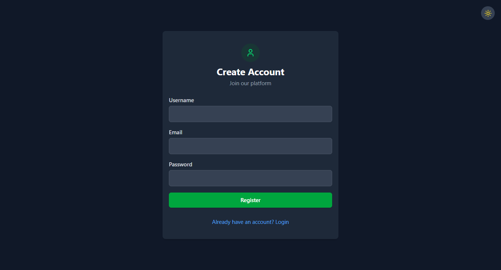
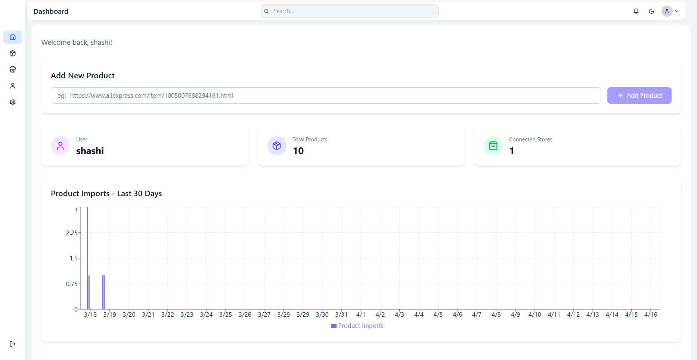
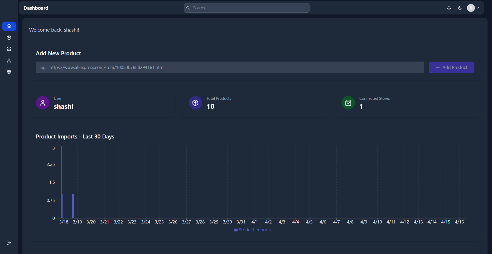

# Free Scraper - AliExpress Product Scraper

<div align="center">
  
</div>

Free Scraper is a powerful dropshipping automation tool that helps e-commerce entrepreneurs easily scrape and import products from AliExpress to their online stores.

## 🔗 Related Repositories

- [Free Scraper Backend](https://github.com/Shashi-Madushan/WebScraperForDropshiping) - Spring Boot backend service  
- [Free Scraper Chrome Extension](https://github.com/yourusername/free-scraper-extension) - Chrome extension for quick product scraping  

## 🌟 Features

- **One-Click Product Scraping**: Instantly extract product data from AliExpress URLs  
- **Multi-Platform Integration**: Support for WooCommerce and Shopify  
- **AI-Powered Descriptions**: Generate unique product descriptions automatically  
- **Price Monitoring**: Track price changes and maintain profit margins  
- **Store Management**: Connect and manage multiple e-commerce stores  
- **Dark Mode Support**: Comfortable viewing experience in any lighting condition  

## 🎥 Demo Video

<div align="center">
  <a href="https://youtu.be/C0yxWhFte68">
    
  </a>
  <p><strong>▶️ Click to watch the demo video</strong></p>
</div>

## 📸 Interface Overview

### Landing & Authentication

<div align="center">
  <table>
    <tr>
      <td width="50%"><strong>Light Mode</strong></td>
      <td width="50%"><strong>Dark Mode</strong></td>
    </tr>
    <tr>
      <td>
        <p><strong>Landing Page (Light)</strong></p>
        
      </td>
      <td>
        <p><strong>Landing Page (Dark)</strong></p>
        
      </td>
    </tr>
    <tr>
      <td>
        <p><strong>User Login</strong></p>
        
      </td>
      <td>
        <p><strong>Admin Login</strong></p>
        
      </td>
    </tr>
    <tr>
      <td>
        <p><strong>User Registration</strong></p>
        
      </td>
      <td></td>
    </tr>
  </table>
</div>

### Dashboard Views

<div align="center">
  <table>
    <tr>
      <td width="50%"><strong>Light Mode</strong></td>
      <td width="50%"><strong>Dark Mode</strong></td>
    </tr>
    <tr>
      <td>
        <p><strong>User Dashboard (Light)</strong></p>
        
      </td>
      <td>
        <p><strong>User Dashboard (Dark)</strong></p>
        
      </td>
    </tr>
    <tr>
      <td>
        <p><strong>Admin Dashboard (Light)</strong></p>
        
      </td>
      <td>
        <p><strong>Admin Dashboard (Dark)</strong></p>
        
      </td>
    </tr>
  </table>
</div>

### Account & User Management

<div align="center">
  <table>
    <tr>
      <td width="50%"><strong>Light Mode</strong></td>
      <td width="50%"><strong>Dark Mode</strong></td>
    </tr>
    <tr>
      <td>
        <p><strong>Admin Account (Light)</strong></p>
        
      </td>
      <td>
        <p><strong>Admin Account (Dark)</strong></p>
        
      </td>
    </tr>
    <tr>
      <td>
        <p><strong>User Account (Light)</strong></p>
        
      </td>
      <td>
        <p><strong>User Account (Dark)</strong></p>
        
      </td>
    </tr>
    <tr>
      <td>
        <p><strong>Admin User Management (Light)</strong></p>
        
      </td>
      <td>
        <p><strong>Admin User Management (Dark)</strong></p>
        
      </td>
    </tr>
  </table>
</div>

### Products & Imports

<div align="center">
  <table>
    <tr>
      <td width="50%"><strong>Light Mode</strong></td>
      <td width="50%"><strong>Dark Mode</strong></td>
    </tr>
    <tr>
      <td>
        <p><strong>Product Details (Light)</strong></p>
        
      </td>
      <td>
        <p><strong>Product Details (Dark)</strong></p>
        
      </td>
    </tr>
    <tr>
      <td>
        <p><strong>Imported Products</strong></p>
        
      </td>
      <td>
        <p><strong>Product JSON View</strong></p>
        
      </td>
    </tr>
    <tr>
      <td>
        <p><strong>Admin Product Management (Light)</strong></p>
        
      </td>
      <td>
        <p><strong>Admin Product Management (Dark)</strong></p>
        
      </td>
    </tr>
  </table>
</div>

### Store Management

<div align="center">
  <table>
    <tr>
      <td width="50%">
        <p><strong>Connected Store (Light)</strong></p>
        
      </td>
      <td width="50%">
        <p><strong>Connected Stores (Dark)</strong></p>
        
      </td>
    </tr>
  </table>

  <table>
    <tr>
      <td>
        <p><strong>Store Selection</strong></p>
        
      </td>
    </tr>
  </table>
</div>

### System Statistics

<div align="center">
  <table>
    <tr>
      <td width="50%"><strong>Light Mode</strong></td>
      <td width="50%"><strong>Dark Mode</strong></td>
    </tr>
    <tr>
      <td>
        <p><strong>Admin Statistics (Light)</strong></p>
        
      </td>
      <td>
        <p><strong>Admin Statistics (Dark)</strong></p>
        
      </td>
    </tr>
  </table>
</div>

### Miscellaneous

<div align="center">
  <table>
    <tr>
      <td width="33%">
        <p><strong>Logout Confirmation</strong></p>
        
      </td>
      <td width="33%">
        <p><strong>Session Expire</strong></p>
        
      </td>
      <td width="33%">
        <p><strong>Product Data JSON View</strong></p>
        
      </td>
    </tr>
  </table>
</div>

---

## 🚀 Getting Started

### Prerequisites

- Node.js (v14 or higher)
- npm or yarn
- A modern web browser

### Installation

```bash
# Clone the repository
git clone https://github.com/yourusername/free-scraper.git

# Navigate to project directory
cd free-scraper

# Install dependencies
npm install

# Start development server
npm run dev
```

## 🏗 Project Structure

```
src/
├── components/         # Reusable UI components
├── pages/              # Page components
├── services/           # API and authentication services
├── assets/             # Static assets
└── App.jsx             # Main application component
```

## 📱 Core Features

### User Features
- **Authentication**
  - Secure registration with email verification
  - JWT-based login system
  - Multi-device support
  - Role-based access control

- **Product Management**
  - One-click AliExpress product scraping
  - Custom pricing rules
  - AI-generated descriptions
  - Image optimization
  - SEO-friendly content

- **Store Integration**
  - WooCommerce & Shopify support
  - Multi-store management
  - API key handling
  - Automated synchronization

### Admin Features
- **User Management**
  - Account administration
  - Role assignment
  - Usage monitoring
  - Activity logging

- **System Control**
  - Real-time statistics
  - Performance monitoring
  - API usage tracking
  - System health checks

## 🔒 Security & API

### Security Features
- JWT authentication
- Role-based access
- Request validation
- Secure password handling

### API Endpoints
```
Authentication:
POST /api/auth/register
POST /api/auth/login
POST /api/auth/admin/login

Products:
GET /api/products
POST /api/scrape/aliexpress
PUT /api/products/:id

Stores:
GET /api/stores
POST /api/stores
PUT /api/stores/:id
```

## 🙏 Acknowledgments

- [React](https://reactjs.org/)
- [Tailwind CSS](https://tailwindcss.com/)
- [Lucide Icons](https://lucide.dev/)
- [Recharts](https://recharts.org/)

<div align="center">
  Built with ❤️ by <a href="https://github.com/yourusername">Shashi Madushan</a>
</div>

